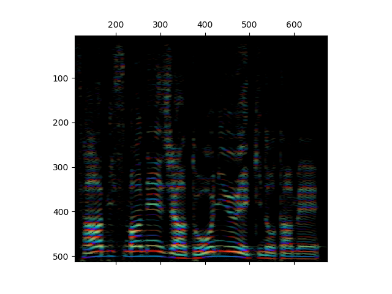

# rainbowgram - represent Magnitude and phase at the same time
**rainbowgram** is time-frequency domain wave representation.  
This library provides many utilities related to rainbowgram (conversion, visualization and so on).  

## Demo

## API lists
* wave2rain
  + convert waveform into rainbowgram
* rain2wave
  + convert rainbowgram into waveform
* rain2graph
  + convert rainbowgram into graph (like spectrogram)

## consideration
### rainbowgram variation
This library defines **rainbowgram** as **magnitude + instantaneous_frequency**, not power, not CQT.  
For usability, scaling on time and/or frequency is desirable.  
This library provides these choice as option, but the standard is above one.  

* magnitude scaling
  + power
  + log
  + range
* IF scaling
  + range (-pi/pi or 0/1)
* frequency scaling
  + mel
    - (filter bank, not yet supported)
    - linear interpolation

### visualization
graph generation, presentation and storing should be separated.  
